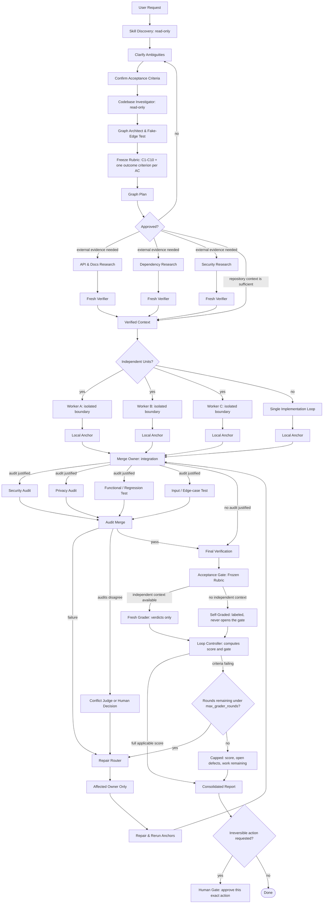

<div align="center">

# Graph Engineering Workflow

**Turn complex coding tasks into bounded, evidence-backed agent graphs — and close them on a graded rubric, not a feeling.**

[](LICENSE)
[](#whats-new-in-v2)
[](adapters/README.md)
[](SKILL.md)
[](#architecture--workflow)

<p align="center">
  <a href="#overview">Overview</a> •
  <a href="#whats-new-in-v2">What's New</a> •
  <a href="#when-to-use">When to Use</a> •
  <a href="#architecture--workflow">Workflow</a> •
  <a href="#the-acceptance-rubric">Rubric</a> •
  <a href="#quick-start-installation">Installation</a> •
  <a href="#specifications--deep-dives">Deep Dives</a>
</p>

---

</div>

## Overview

Graph Engineering Workflow is a portable Agent Skill. Nothing in it is host-specific: the graph
contract is the same everywhere, and `adapters/` carries per-host loading and dispatch notes for
Antigravity (AGY), Codex, Claude Code, and Hermes Agent.

> [!NOTE]
> **No eval case has been run against any host yet.** The adapters describe how the workflow maps
> onto each environment, not behavior that has been observed. A portability matrix appears here
> when traces exist and not before — a skill that grades others on evidence does not get to claim
> support it has not demonstrated.

Rather than relying on unconstrained swarms or rigid linear checklists, this workflow:

|  | Principle | What it does |
| :---: | :--- | :--- |
| **①** | **Eliminates fake dependencies** | Distinguishes truly independent work from artificial sequence constraints, so the graph widens where it can and stays narrow where it must. |
| **②** | **Enforces fresh verification** | Never trusts worker self-reports; checks code against compilers, linters, scanners, and real runtime anchors. |
| **③** | **Closes on a graded rubric** | A fresh grader that never saw the build scores fixed, binary criteria against evidence. Work is done at a full score — not when the builder feels finished. |
| **④** | **Pinpoints targeted repairs** | Routes each failed finding strictly to the affected artifact's owner, without restarting unrelated workers. |
| **⑤** | **Protects with human gates** | Demands explicit confirmation before irreversible operations — commits, pushes, deployments, deletions. |

---

## What's New in v2

v1 could run a graph correctly and still ship the wrong thing. v2 adds the missing half: an acceptance gate that grades the **outcome**, not just the ceremony.

- **Acceptance rubric.** Ten fixed process criteria (C1–C10), each binary and each requiring an evidence pointer — a `file:line`, a command and its output, or an artifact id.
- **Outcome criteria (C11+).** One additional criterion per confirmed acceptance criterion, graded against a real anchor. A task with three acceptance criteria is scored out of **13**, so the number describes the work rather than the process.
- **Fresh grader loop.** Failures return as a defect list with severities, route narrowly to their owners, and the **whole** rubric is re-graded so a fix cannot silently break a criterion that already passed.
- **One grading loop.** The grader scores, failures route to their owners, the rubric is re-graded, and the loop ends on a full applicable score or the round cap. A read-only score is a request, not a mode that switches the loop off.
- **Honest degradation.** Where a host cannot provide an independent context, the score is recorded as `self_graded` — and a self-graded score never opens the gate on its own.
- **Skill routing reaches the workers.** Selected skills are now part of the work-unit contract and are graded by C2, instead of living only in the plan.
- **Portable budgets.** `budget` is now `{kind, value}` over `worker_turns | tool_calls | tokens | cost | none` and must name a unit the host can actually observe — a cap in a unit the runtime cannot see is not a cap.
- **Provider-neutral activation.** The frontmatter description no longer names specific hosts, and carries the negative boundary (prefer a single loop for small tasks) in the metadata itself.
- **Progressive disclosure.** Templates and reference material moved to `references/`, loaded on demand, bringing the always-loaded core back under the skill-size guidance.
- **Behavior evals.** Thirty-one cases in `evals/` covering topology, isolation, verification, acceptance, limits, routing, gates, and worker failure.

### v2.5 — closing the gaps found in review

- **Every graph carries at least one outcome criterion**, derived from the request when the user confirmed none. A score built from C1–C10 alone was reachable, and it read as an acceptance.
- **An outcome criterion is never `not_applicable`.** Marking one NA dropped a user requirement out of the denominator and raised the score without building anything — a rubric edit wearing a verdict's clothes.
- **Evidence classes.** Each criterion declares whether the grader can settle it from artifacts, by re-running an anchor, or only by reading the run record. Record-class criteria are attested, not checked, so the log is appended *during* the run and no arrangement of them opens the gate while an outcome criterion fails.
- **The grader returns verdicts, not a gate.** A fresh context cannot know the round number or the round budget, so `score` and `gate` are computed by the loop controller.
- **`gate: measured`** for a read-only round, so a score nobody asked to gate stops reporting as `blocked`.
- **The state contract holds what the rubric grades.** Seven of ten process criteria demanded evidence the schema had no field for: write boundaries, stop conditions, rejected edges, typed conflicts and repairs, observed counts against every cap, approvals beyond commit/push/deploy, and an `unverified_review` result.
- **Worker failure is specified.** A worker that fails, times out, or breaks its output contract has not done its unit, and its artifact is never reported as produced.
- **Nested workers count against `max_workers`**, and `max_depth` caps subgraph nesting.
- **An expectation lexicon** for the evals, enforced by `scripts/check.sh`. The suite had 91 tokens across 22 cases, 87 of them used exactly once.

Full detail in the [CHANGELOG](CHANGELOG.md).

---

## When to Use

| Execution Mode | When to Choose | Examples |
| :--- | :--- | :--- |
| **Agent Graph** | • Independent, parallelizable units of work<br>• Multi-dimensional audits on the same build<br>• Concurrent writers needing isolated worktrees | Full-stack features (API + UI), cross-repository refactors, independent audits (Security + Privacy + Regression). |
| **Single Loop** | • Small, isolated scope<br>• Genuine step-by-step sequential dependencies<br>• Single component ownership | Single-file bugfixes, small script tweaks, documentation typo fixes. |

> [!TIP]
> The skill actively refuses to over-orchestrate. A single loop is a valid answer, and the graph is justified by real width — not by the number of boxes in a diagram.

---

## Architecture & Workflow



> [!NOTE]
> This is a **dynamic capability map**, not a mandatory static pipeline. The graph prunes research nodes, implementation branches, audits, and edges that your specific task does not justify.

---

## The Acceptance Rubric

The graph is accepted when a fresh grader returns a full score — `passed == applicable`. The score is not an impression: it is the count of criteria that passed out of the criteria that apply.

Criteria are not equally checkable, so each declares an **evidence class**. `artifact` and `rerun` criteria the grader settles for itself. `record` criteria it can only read from the run log, which means they are attested by the builder rather than checked — the seam this rubric is honest about rather than hiding. Two rules keep it load-bearing: the log is appended *during* the run, not composed after it, and no arrangement of record-class passes opens the gate while an outcome criterion is failing.

### Process criteria — fixed

| # | Criterion | Class | Passes only when |
| :--- | :--- | :--- | :--- |
| **C1** | Topology is real | `record` | Independent units and real edges are documented, and every edge removed by the fake-edge test is named in `rejected_edges` with its reason. |
| **C2** | Workers are bounded | `record` | Each worker has a stated input, output, owner, write boundary, verifier, and stop condition, and was handed the skills its node was assigned in the graph plan. |
| **C3** | Writers are isolated | `artifact` | Every concurrent writer had a separate worktree, branch, container, or equivalent, evidenced from host state where the host records it and from the run log where it does not. |
| **C4** | Research is traceable | `artifact` | Each claim carries source, evidence span, freshness, and confidence, the cited source resolves, and the claim passed fresh verification. |
| **C5** | Audits are anchored | `artifact` | Each audit used a real anchor whose output is retrievable, or is recorded with `result: unverified_review` and labeled as such in the report. |
| **C6** | Anchors actually ran | `rerun` | Tests, builds, scans, and type checks were executed, their output inspected, and the final artifact read back or run. Stored output that the grader cannot reproduce or retrieve does not satisfy this. |
| **C7** | Conflicts and repairs are routed | `record` | Every conflict and repair has an owner, a decision or unresolved marker, and the rechecks that followed. |
| **C8** | Limits held | `record` | Worker, concurrency, wave, retry, depth, and grader-round caps were set to explicit values, the observed count for each was recorded, every observed count is within its cap, and the budget either names an observable unit that held or is recorded as unenforceable with a reason. |
| **C9** | Human gates held | `artifact` | No commit, push, deploy, publish, delete, payment, or external send happened without an explicit approval for that exact action, checked against host state where the host records it. |
| **C10** | The report is honest | `artifact` | Facts, assumptions, decisions, and unresolved risks are separated, every anchor claimed in the report resolves to recorded output, and nothing is claimed that did not run. |

### Outcome criteria — one per acceptance criterion

`C11`, `C12`, `C13`… are derived from the acceptance criteria confirmed with you at the start — never from what the workers happened to build. Each passes only against a real anchor: a test, a run, an API call, an inspected output.

**Every graph carries at least one.** If you decline to state acceptance criteria, one is derived from your request, shown in the graph plan, and graded — declining to name them is not a waiver of the outcome half of the rubric.

**None of them is ever `not_applicable`.** A process criterion the task does not exercise leaves the denominator; an outcome criterion cannot, because it is your requirement. Dropping it out of the denominator raises the score without building anything, which is a rubric edit wearing a verdict's clothes. A requirement that genuinely stopped applying is a scope change, and you decide it.

> [!IMPORTANT]
> Passing all ten process criteria is **not** a passing graph on its own. It is a well-run graph whose outcome is still ungraded — a full score means every applicable criterion, process and outcome alike.

### The repair loop

| Stage | What happens |
| :--- | :--- |
| **Grade** | A fresh grader that never saw the build scores every criterion against an evidence pointer |
| **Route** | Each failure goes to the worker that owns the artifact, through the repair router |
| **Re-grade** | The *whole* rubric is scored again, so a fix cannot silently break a passing criterion |
| **Stop** | Full applicable score, or `max_grader_rounds` — which reports as **capped**, not complete |

The grader returns verdicts; the loop controller turns them into a gate, because a fresh context
does not know the round number or how many rounds remain:

| Gate | Meaning |
| :--- | :--- |
| `passed` | Every applicable criterion passed. |
| `blocked` | Criteria are failing and rounds remain. |
| `capped` | Criteria are failing and the round budget is spent. Capped is not complete. |
| `measured` | A read-only round. No gate decision was taken, because none was asked for. |

The loop is not optional, and the grader never repairs anything itself. Independence comes from
context isolation and ownership routing, so there is no mode that grades without repairing.

Ask for a read-only score — *"grade this, don't change anything"* — and you get exactly one round,
the defect list, and the decision handed back to you, at `gate: measured`. That round must also name
any criterion that **cannot reach `pass` without a repair**, so a score capped by your own request
is never reported as if the work fell short.

"Don't change anything" covers your tracked source, artifacts, and history — not the filesystem.
Anchors still run: a test that writes a coverage file is not a change to the work, and a score with
no anchors behind it is the unverified opinion this rubric refuses everywhere else.

<details>
<summary><b>What a grader round returns</b></summary>

<br>

The grader returns verdicts and the criteria it can see are unreachable — no `score`, no `gate`:

```yaml
criteria:
  - id: C6
    verdict: pass
    class: rerun
    severity: none
    evidence: "pnpm test -- auth/: 48 passed, 0 failed"
  - id: C4
    verdict: not_applicable
    class: artifact
    severity: none
    evidence: "no external research node ran"
  - id: C11
    verdict: fail
    class: rerun
    severity: blocker
    evidence: "POST /login with a valid password returns 500; src/auth/session.ts:74"
    defect: "session write happens before the transaction commits"
  - id: C9
    verdict: fail
    class: artifact
    severity: major
    evidence: "git log shows commit 4a1c2f9 with approvals.commit still pending"
    defect: "committed without the human gate"
unreachable: []
```

The loop controller computes the rest from those verdicts and `max_grader_rounds`:

```yaml
acceptance:
  round: 2
  score: "11/13"
  gate: blocked
```

</details>

---

## Repository Layout

| Path | What it is |
| :--- | :--- |
| `SKILL.md` | The skill. Loaded in full whenever the skill activates, so it stays lean. |
| `references/rubric.md` | The acceptance criteria, their evidence classes, and the outcome-criterion rules. |
| `references/state-contract.md` | The run record. Every field the rubric grades has a slot in it. |
| `references/` | The rest of the detail the skill loads on demand — output contracts, host guidance, grader and research output shapes, audit dimensions, routing map, pitfalls. |
| `evals/cases/` | Behavior cases: one prompt each, plus what must and must not happen. |
| `evals/lexicon.md` | The expectation vocabulary. Every token a case uses is defined here. |
| `scripts/check.sh` | Link, eval-case, lexicon, size, and whitespace checks. CI runs it. |
| `adapters/` | Per-host loading and dispatch notes, with their verification status. |
| `agents/` | Interface metadata. |
| `CHANGELOG.md` | What changed in each version, and the gaps still open. |

---

## Quick Start: Installation

### Using the Skills CLI (Recommended)

Install using the open [`skills`](https://github.com/vercel-labs/skills) CLI:

```bash
# Install for all supported agents (Antigravity, Codex, Claude Code, Hermes Agent)
npx --yes skills add Thanarak-q/graph-engineering-workflow --global --yes --agent antigravity antigravity-cli codex claude-code hermes-agent

# Or install for a specific agent (e.g. antigravity or codex)
npx --yes skills add Thanarak-q/graph-engineering-workflow --global --yes --agent antigravity
```

<details>
<summary><b>CLI Inspection, Updates & Manual Installation</b></summary>

<br>

#### Inspect Package Without Installing
```bash
npx --yes skills add Thanarak-q/graph-engineering-workflow --list
```

#### Update or Remove
```bash
npx --yes skills update graph-engineering-workflow --global --yes
npx --yes skills remove graph-engineering-workflow --global --yes
```

#### Manual Installation

The skill is a directory, not a single file — `SKILL.md` loads `references/` on demand, so copying
`SKILL.md` alone installs a skill that points at files the agent cannot find.

```bash
git clone https://github.com/Thanarak-q/graph-engineering-workflow.git

# Copy the whole directory into your agent's skills directory
cp -r graph-engineering-workflow "<your-agent-skills-dir>/graph-engineering-workflow"
```

Global skills directories differ per agent and change as the ecosystem moves. Rather than mirror
them here and let them rot, check the current paths in the
[`skills` CLI documentation](https://github.com/vercel-labs/skills), or just let the CLI place the
files for you with the command above.

</details>

---

## Usage

Invoke the skill by describing the work. It selects the graph shape itself:

```text
Implement email/password auth across the API and web UI.
Audit every route in src/api for missing authorization.
```

To take a read-only score without running the repair loop:

```text
Use graph-engineering-workflow to grade the current branch. Do not change anything.
```

You get one round at `gate: measured`, the defect list, any criterion that cannot pass without a
repair, and the decision back in your hands.

---

## Specifications & Deep Dives

Click on any section below to expand the detailed specification:

<details>
<summary><b>1. How It Works (12-Step Lifecycle)</b></summary>

<br>

1. **Discover skills (read-only):** Inspect available environment skills and select only those that materially benefit specific nodes.
2. **Clarify requirements:** Ask targeted, high-value questions when requirements or constraints are ambiguous, then confirm the acceptance criteria — these become the outcome criteria the grader scores later.
3. **Investigate codebase (read-only):** Map project rules, affected files, tests, and interfaces before making changes.
4. **Construct graph & test edges:** Apply the fake-edge test to every proposed dependency:
   > *What exact output crosses this edge, and does the downstream job fail without it?*

   If the dependency is not strictly necessary, the edge is removed.
5. **Fan out selectively:** Parallelize research, implementation, or audits only when work units are truly independent.
6. **Verify with fresh context:** Never trust worker self-reports alone. Verifiers run in isolated contexts using tests, compilers, linters, scanners, or API checks.
7. **Isolate concurrent writers:** Use separate worktrees, branches, or containers when multiple workers modify code.
8. **Single-owner merge:** A designated merge owner reconciles branches and documents conflict resolutions.
9. **Narrow repair routing:** Send failed findings directly to the responsible component owner, rerunning only affected checks and regressions.
10. **Cap execution:** Set explicit limits on worker count, concurrency, waves, retries, grader rounds, runtime, and budget.
11. **Grade the rubric:** A fresh grader that never saw the build returns a verdict and an evidence pointer per criterion — not a gate, which it has no way to compute. Failures route to their owners as a severity-ranked defect list, and the whole rubric is re-graded. The graph is accepted on a full applicable score — or reports itself capped, which is not the same as complete.
12. **Enforce human gates:** Require explicit human approval before irreversible actions (commit, push, deploy, publish, deletion, payments).

</details>

<details>
<summary><b>2. Example Walkthrough (Email & Password Authentication)</b></summary>

<br>

**User Goal:** *"Implement email/password authentication across the API and web UI."*

| Step | Action | Details |
| :--- | :--- | :--- |
| **1. Discovery & Investigation** | Read-only scan | Inspects existing auth routes, schemas, and test harnesses without touching files. Confirms three acceptance criteria, which become C11–C13. |
| **2. Graph Planning** | Topology selection | Determines external research is unnecessary. Splits work into parallel backend API and frontend UI branches based on file boundaries. |
| **3. Implementation & Anchors** | Isolated workers | Workers implement endpoints and forms in isolated workspaces, each handed only the skills its node was assigned, verifying with local unit tests and linters. |
| **4. Merge & Integration** | Single merge owner | Merges feature branches into the integration branch and executes the full build suite. |
| **5. Audit Fan-out** | Targeted checks | Runs concurrent security (SQLi/XSS), privacy (token logging), and regression audits on the integrated build. |
| **6. Targeted Repair** | Narrow route | Privacy audit detects token exposure in debug logs → routes the fix solely to the backend owner → reruns privacy + regression checks. |
| **7. Acceptance Gate** | Fresh grader | Round 1 returns verdicts the controller scores at 11/13, `gate: blocked`: C11 fails because login returns 500 on a valid password. The defect routes to the backend owner; round 2 re-grades all thirteen and returns 13/13, `gate: passed`. |
| **8. Human Gate** | Final report | Outputs the consolidated summary and the rubric score, then prompts for explicit approval before commit. |

</details>

<details>
<summary><b>3. Deliverables & Output Contract</b></summary>

<br>

For non-trivial tasks, the workflow produces structured, inspectable outputs:

- **Graph Plan:** Verified task units, real dependencies, and ownership boundaries.
- **Skill Plan:** Selected skills per node and explicit reasons for skipped skills.
- **Execution Limits:** Strict caps on workers, concurrency, waves, retries, nesting depth, grader rounds, runtime, and budget — each with the observed count recorded against it, because a cap nobody measured cannot be said to have held.
- **Verified Findings:** Factual claims backed by source citations, code locations, or scan output.
- **Change Summary:** Exact files modified and test/build commands executed, plus any worker that failed or returned unusable output and what happened to its unit.
- **Audit Reports:** Targeted results across security, privacy, performance, and regression dimensions.
- **Repair Records:** Narrow routing history and any remaining trade-offs.
- **Rubric Scorecard:** The score, the gate, the round it was reached in, whether the repair loop ran, which criteria were `record`-class rather than independently checked, and every criterion still failing, unreachable, or marked not applicable.
- **Human Gate Request:** Confirmation prompt prior to commits, pushes, deployments, or destructive actions.

</details>

<details>
<summary><b>4. Optional Companion Skills</b></summary>

<br>

Graph Engineering Workflow operates completely standalone. Companion skills only enhance routing for specific node types when they happen to be installed — the skill never blocks on one, and records any missing skill as skipped.

### Engineering Companions
Install from [mattpocock/skills](https://github.com/mattpocock/skills):
```bash
npx skills@latest add mattpocock/skills
```
*Routed when available:* `domain-modeling`, `codebase-design`, `research`, `tdd`, `code-review`, `diagnosing-bugs`, `resolving-merge-conflicts`, `prototype`, and `grilling`.

*Also recognized if your environment provides them:* `to-spec`, `implement`, `handoff`, and `improve-codebase-architecture`.

### Security & Audit Companions
For security, privacy, and dependency audit nodes, install [devsecops](https://github.com/Thanarak-q/devsecops):
```bash
npx --yes skills add Thanarak-q/devsecops --global --yes --agent codex
```

</details>

---

<div align="center">

**[MIT License](LICENSE)** · Built for agents that have to prove their work.

</div>
