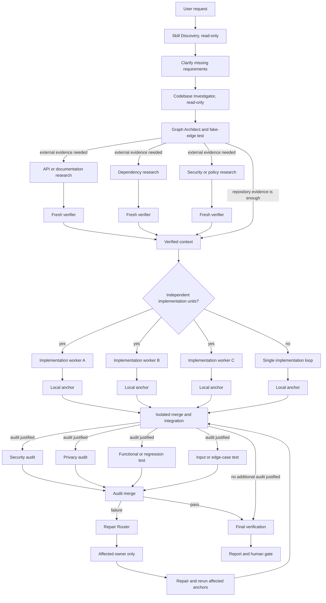

# Graph Engineering Workflow

## Overview

A portable Agent Skill for Codex, Claude Code, Hermes Agent, and other agent platforms. It transforms complex software engineering tasks into bounded, evidence-backed agent graphs.

The skill identifies independent units of work, removes fake dependencies, verifies worker output against concrete evidence, and routes failures directly to the owner of the affected code.

## When to Use It

- **Use an agent graph when:** Work units are independent (e.g. backend vs. frontend, multi-file migrations, parallel research), independent verification is critical, or multiple audits (security, privacy, performance) inspect the same integrated build.
- **Use a single-agent loop when:** The task is small, sequential dependencies are strictly required, or a single component owns the entire change.

## Workflow



> **Note:** This is a capability map, not a rigid sequence. The graph prunes research, implementation branches, audits, and edges that the specific task does not justify.

## How It Works

1. **Discover skills (read-only):** Inspect available environment skills and select only those that materially benefit specific nodes.
2. **Clarify requirements:** Ask targeted, high-value questions when requirements or constraints are ambiguous.
3. **Investigate codebase (read-only):** Map project rules, affected files, tests, and interfaces before making changes.
4. **Construct graph & test edges:** Apply the fake-edge test to every proposed dependency:
   > *What exact output crosses this edge, and does the downstream job fail without it?*
   If the dependency is not strictly necessary, the edge is removed.
5. **Fan out selectively:** Parallelize research, implementation, or audits only when work units are truly independent.
6. **Verify with fresh context:** Never trust worker self-reports alone. Verifiers run in isolated contexts using tests, compilers, linters, scanners, or API checks.
7. **Isolate concurrent writers:** Use separate worktrees, branches, or containers when multiple workers modify code.
8. **Single-owner merge:** A designated merge owner reconciles branches and documents conflict resolutions.
9. **Narrow repair routing:** Send failed audit findings directly to the responsible component owner, rerunning only affected checks and regressions.
10. **Cap execution:** Set explicit limits on worker count, concurrency, waves, retries, runtime, and budget.
11. **Enforce human gates:** Require explicit human approval before irreversible actions (commit, push, deploy, publish, deletion, payments).

## Example Walkthrough

**Request:** *"Implement email/password authentication across the API and web UI."*

1. **Discovery & Investigation:** The agent discovers available skills, clarifies requirements, and inspects existing auth routes, schemas, and tests without modifying files.
2. **Graph Planning:** If repository documentation is sufficient, external research is skipped. Backend API endpoints and frontend login forms have distinct file boundaries, so they run in parallel worker branches.
3. **Integration & Audit:** Once local tests pass, the merge owner integrates the branches and runs targeted security, privacy, and regression checks.
4. **Targeted Repair:** If a privacy audit identifies sensitive token logging in an API route, the Repair Router assigns the fix only to the backend owner, then reruns the privacy and regression tests.
5. **Human Gate:** After final verification passes, the agent reports evidence and prompts for approval before committing.

## Deliverables

For non-trivial tasks, the workflow produces:

- **Graph Plan:** Verified task units, real dependencies, and ownership boundaries.
- **Skill Plan:** Selected skills per node and explanations for skipped skills.
- **Execution Limits:** Explicit caps on workers, concurrency, retries, runtime, and budget.
- **Verified Findings:** Factual claims backed by source citations, code locations, or scan output.
- **Change Summary:** Exact files modified and test/build commands executed.
- **Audit Reports:** Targeted results across security, privacy, performance, and regression dimensions.
- **Repair Records:** Narrow routing history and any remaining trade-offs.
- **Human Gate Request:** Confirmation prompt prior to commits, pushes, deployments, or destructive actions.

## Installation

### Using the Skills CLI

The recommended installer is the [`skills`](https://github.com/vercel-labs/skills) CLI:

#### Install for all supported agents
```bash
npx --yes skills add Thanarak-q/graph-engineering-workflow \
  --global \
  --yes \
  --agent codex claude-code hermes-agent
```

#### Install for a single agent
Replace `codex` with `claude-code` or `hermes-agent`:
```bash
npx --yes skills add Thanarak-q/graph-engineering-workflow \
  --global \
  --yes \
  --agent codex
```

#### Inspect without installing
```bash
npx --yes skills add Thanarak-q/graph-engineering-workflow --list
```

#### Update or Remove
```bash
npx --yes skills update graph-engineering-workflow --global --yes
npx --yes skills remove graph-engineering-workflow --global --yes
```

### Manual Installation (macOS / Linux)

```bash
git clone https://github.com/Thanarak-q/graph-engineering-workflow.git
cd graph-engineering-workflow
```

Copy `SKILL.md` to your target agent directory:

```bash
# Codex / Universal Agent Skills
mkdir -p "$HOME/.agents/skills/graph-engineering-workflow"
cp SKILL.md "$HOME/.agents/skills/graph-engineering-workflow/SKILL.md"

# Claude Code
mkdir -p "$HOME/.claude/skills/graph-engineering-workflow"
cp SKILL.md "$HOME/.claude/skills/graph-engineering-workflow/SKILL.md"

# Hermes Agent
mkdir -p "${HERMES_HOME:-$HOME/.hermes}/skills/graph-engineering-workflow"
cp SKILL.md "${HERMES_HOME:-$HOME/.hermes}/skills/graph-engineering-workflow/SKILL.md"
```

## Optional Companion Skills

Graph Engineering Workflow operates independently. Companion skills enhance routing for specific node types when installed:

### Engineering Companions
Install from [mattpocock/skills](https://github.com/mattpocock/skills):
```bash
npx skills@latest add mattpocock/skills
```
Recommended skills: `to-spec`, `domain-modeling`, `codebase-design`, `research`, `implement`, `tdd`, `code-review`, `diagnosing-bugs`, `resolving-merge-conflicts`, `handoff`, `prototype`, `improve-codebase-architecture`, and `grill-me`.

### Security & Audit Companions
For security, privacy, and dependency audit nodes, install [devsecops](https://github.com/Thanarak-q/devsecops):
```bash
npx --yes skills add Thanarak-q/devsecops --global --yes --agent codex
```

## License

[MIT](LICENSE)
