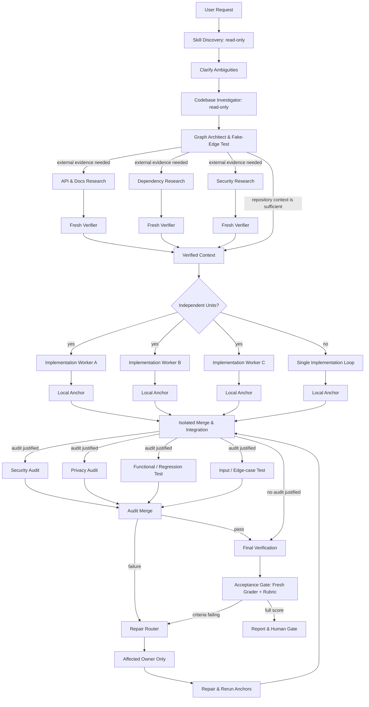

<div align="center">

# Graph Engineering Workflow

**Turn complex coding tasks into bounded, evidence-backed agent graphs — and close them on a graded rubric, not a feeling.**

[](LICENSE)
[](#whats-new-in-v2)
[](SKILL.md)
[](SKILL.md)
[](#architecture--workflow)

<p align="center">
  <a href="#overview">Overview</a> •
  <a href="#whats-new-in-v2">What's New</a> •
  <a href="#when-to-use">When to Use</a> •
  <a href="#architecture--workflow">Workflow</a> •
  <a href="#the-acceptance-rubric">Rubric</a> •
  <a href="#quick-start-installation">Installation</a> •
  <a href="#specifications--deep-dives">Deep Dives</a>
</p>

---

</div>

## Overview

Graph Engineering Workflow is a portable Agent Skill for Antigravity (AGY), Codex, Claude Code, Hermes Agent, and modern agentic coding environments.

Rather than relying on unconstrained swarms or rigid linear checklists, this workflow:

|  | Principle | What it does |
| :---: | :--- | :--- |
| **①** | **Eliminates fake dependencies** | Distinguishes truly independent work from artificial sequence constraints, so the graph widens where it can and stays narrow where it must. |
| **②** | **Enforces fresh verification** | Never trusts worker self-reports; checks code against compilers, linters, scanners, and real runtime anchors. |
| **③** | **Closes on a graded rubric** | A fresh grader that never saw the build scores fixed, binary criteria against evidence. Work is done at a full score — not when the builder feels finished. |
| **④** | **Pinpoints targeted repairs** | Routes each failed finding strictly to the affected artifact's owner, without restarting unrelated workers. |
| **⑤** | **Protects with human gates** | Demands explicit confirmation before irreversible operations — commits, pushes, deployments, deletions. |

---

## What's New in v2

v1 could run a graph correctly and still ship the wrong thing. v2 adds the missing half: an acceptance gate that grades the **outcome**, not just the ceremony.

- **Acceptance rubric.** Ten fixed process criteria (C1–C10), each binary and each requiring an evidence pointer — a `file:line`, a command and its output, or an artifact id.
- **Outcome criteria (C11+).** One additional criterion per confirmed acceptance criterion, graded against a real anchor. A task with three acceptance criteria is scored out of **13**, so the number describes the work rather than the process.
- **Fresh grader loop.** Failures return as a defect list with severities, route narrowly to their owners, and the **whole** rubric is re-graded so a fix cannot silently break a criterion that already passed.
- **Two grading modes.** `hybrid` grades and repairs; `score-only` measures and stops.
- **Honest degradation.** Where a host cannot provide an independent context, the score is recorded as `self_graded` — and a self-graded score never closes the gate on its own.
- **Skill routing reaches the workers.** Selected skills are now part of the work-unit contract and are graded by C2, instead of living only in the plan.

---

## When to Use

| Execution Mode | When to Choose | Examples |
| :--- | :--- | :--- |
| **Agent Graph** | • Independent, parallelizable units of work<br>• Multi-dimensional audits on the same build<br>• Concurrent writers needing isolated worktrees | Full-stack features (API + UI), cross-repository refactors, independent audits (Security + Privacy + Regression). |
| **Single Loop** | • Small, isolated scope<br>• Genuine step-by-step sequential dependencies<br>• Single component ownership | Single-file bugfixes, small script tweaks, documentation typo fixes. |

> [!TIP]
> The skill actively refuses to over-orchestrate. A single loop is a valid answer, and the graph is justified by real width — not by the number of boxes in a diagram.

---

## Architecture & Workflow



> [!NOTE]
> This is a **dynamic capability map**, not a mandatory static pipeline. The graph prunes research nodes, implementation branches, audits, and edges that your specific task does not justify.

---

## The Acceptance Rubric

The graph closes when a fresh grader returns a full score. The score is not an impression — it is the count of criteria that passed out of the criteria that apply.

### Process criteria — fixed

| # | Criterion | Passes only when |
| :--- | :--- | :--- |
| **C1** | Topology is real | Independent units and real edges are documented, and every removed fake edge is named. |
| **C2** | Workers are bounded | Each worker has a stated input, output, owner, write boundary, and stop condition, and was handed the skills its node was assigned. |
| **C3** | Writers are isolated | Every concurrent writer had a separate worktree, branch, container, or equivalent. |
| **C4** | Research is traceable | Each claim carries source, evidence span, freshness, and confidence, and passed fresh verification. |
| **C5** | Audits are anchored | Each audit used a real anchor, or is explicitly labeled an unverified review. |
| **C6** | Anchors actually ran | Tests, builds, scans, and type checks were executed, their output inspected, and the final artifact read back or run. |
| **C7** | Conflicts and repairs are routed | Every conflict and repair has an owner, a decision or unresolved marker, and the rechecks that followed. |
| **C8** | Limits held | Worker, concurrency, wave, retry, time, budget, and grader-round caps were set explicitly and respected. |
| **C9** | Human gates held | Nothing irreversible happened without an explicit approval for that exact action. |
| **C10** | The report is honest | Facts, assumptions, decisions, and unresolved risks are separated, and nothing is claimed that did not run. |

### Outcome criteria — one per acceptance criterion

`C11`, `C12`, `C13`… are derived from the acceptance criteria confirmed with you at the start — never from what the workers happened to build. Each passes only against a real anchor: a test, a run, an API call, an inspected output.

> [!IMPORTANT]
> `10/10` on the process criteria alone is **not** a passing graph. It is a well-run graph whose outcome is still ungraded.

### Grading modes

| Mode | Grader | Repair | Writes | Ends when |
| :--- | :--- | :--- | :---: | :--- |
| **`hybrid`** *(default)* | Scores the rubric and returns a defect list | Routes every failure to its owner, then re-grades | Yes | Full score, or the grader-round cap is reached |
| **`score-only`** | Scores the rubric and returns a defect list | None | No | You say so, or there is nothing new to grade |

Ask for `score-only` when you want an untouched measurement — a grader that repairs what it measures is no longer an independent measurement.

<details>
<summary><b>What a grader round returns</b></summary>

<br>

```yaml
mode: hybrid
round: 2
score: "11/13"
gate: closed
criteria:
  - id: C6
    verdict: pass
    severity: none
    evidence: "pnpm test -- auth/: 48 passed, 0 failed"
  - id: C4
    verdict: not_applicable
    severity: none
    evidence: "no external research node ran"
  - id: C11
    verdict: fail
    severity: blocker
    evidence: "POST /login with a valid password returns 500; src/auth/session.ts:74"
    defect: "session write happens before the transaction commits"
  - id: C9
    verdict: fail
    severity: major
    evidence: "git log shows commit 4a1c2f9 with approvals.commit still pending"
    defect: "committed without the human gate"
```

</details>

---

## Quick Start: Installation

### Using the Skills CLI (Recommended)

Install using the open [`skills`](https://github.com/vercel-labs/skills) CLI:

```bash
# Install for all supported agents (Antigravity, Codex, Claude Code, Hermes Agent)
npx --yes skills add Thanarak-q/graph-engineering-workflow --global --yes --agent antigravity antigravity-cli codex claude-code hermes-agent

# Or install for a specific agent (e.g. antigravity or codex)
npx --yes skills add Thanarak-q/graph-engineering-workflow --global --yes --agent antigravity
```

<details>
<summary><b>CLI Inspection, Updates & Manual Installation</b></summary>

<br>

#### Inspect Package Without Installing
```bash
npx --yes skills add Thanarak-q/graph-engineering-workflow --list
```

#### Update or Remove
```bash
npx --yes skills update graph-engineering-workflow --global --yes
npx --yes skills remove graph-engineering-workflow --global --yes
```

#### Manual Installation (macOS / Linux)
```bash
git clone https://github.com/Thanarak-q/graph-engineering-workflow.git
cd graph-engineering-workflow

# Antigravity / Codex / Universal Agent Skills
mkdir -p "$HOME/.agents/skills/graph-engineering-workflow"
cp SKILL.md "$HOME/.agents/skills/graph-engineering-workflow/SKILL.md"

# Antigravity Global Config
mkdir -p "$HOME/.gemini/config/skills/graph-engineering-workflow"
cp SKILL.md "$HOME/.gemini/config/skills/graph-engineering-workflow/SKILL.md"

# Claude Code
mkdir -p "$HOME/.claude/skills/graph-engineering-workflow"
cp SKILL.md "$HOME/.claude/skills/graph-engineering-workflow/SKILL.md"

# Hermes Agent
mkdir -p "${HERMES_HOME:-$HOME/.hermes}/skills/graph-engineering-workflow"
cp SKILL.md "${HERMES_HOME:-$HOME/.hermes}/skills/graph-engineering-workflow/SKILL.md"
```

</details>

---

## Usage

Invoke the skill by describing the work. It selects the graph shape itself:

```text
Implement email/password auth across the API and web UI.
Audit every route in src/api for missing authorization.
```

To control the grading mode explicitly:

```text
Use graph-engineering-workflow in score-only mode to grade the current branch.
```

---

## Specifications & Deep Dives

Click on any section below to expand the detailed specification:

<details>
<summary><b>1. How It Works (12-Step Lifecycle)</b></summary>

<br>

1. **Discover skills (read-only):** Inspect available environment skills and select only those that materially benefit specific nodes.
2. **Clarify requirements:** Ask targeted, high-value questions when requirements or constraints are ambiguous, then confirm the acceptance criteria — these become the outcome criteria the grader scores later.
3. **Investigate codebase (read-only):** Map project rules, affected files, tests, and interfaces before making changes.
4. **Construct graph & test edges:** Apply the fake-edge test to every proposed dependency:
   > *What exact output crosses this edge, and does the downstream job fail without it?*

   If the dependency is not strictly necessary, the edge is removed.
5. **Fan out selectively:** Parallelize research, implementation, or audits only when work units are truly independent.
6. **Verify with fresh context:** Never trust worker self-reports alone. Verifiers run in isolated contexts using tests, compilers, linters, scanners, or API checks.
7. **Isolate concurrent writers:** Use separate worktrees, branches, or containers when multiple workers modify code.
8. **Single-owner merge:** A designated merge owner reconciles branches and documents conflict resolutions.
9. **Narrow repair routing:** Send failed findings directly to the responsible component owner, rerunning only affected checks and regressions.
10. **Cap execution:** Set explicit limits on worker count, concurrency, waves, retries, grader rounds, runtime, and budget.
11. **Grade the rubric:** A fresh grader that never saw the build scores every criterion against an evidence pointer. Failures return as a severity-ranked defect list, route to their owners, and the whole rubric is re-graded. The graph closes on a full score — or reports itself capped, which is not the same as complete.
12. **Enforce human gates:** Require explicit human approval before irreversible actions (commit, push, deploy, publish, deletion, payments).

</details>

<details>
<summary><b>2. Example Walkthrough (Email & Password Authentication)</b></summary>

<br>

**User Goal:** *"Implement email/password authentication across the API and web UI."*

| Step | Action | Details |
| :--- | :--- | :--- |
| **1. Discovery & Investigation** | Read-only scan | Inspects existing auth routes, schemas, and test harnesses without touching files. Confirms three acceptance criteria, which become C11–C13. |
| **2. Graph Planning** | Topology selection | Determines external research is unnecessary. Splits work into parallel backend API and frontend UI branches based on file boundaries. |
| **3. Implementation & Anchors** | Isolated workers | Workers implement endpoints and forms in isolated workspaces, each handed only the skills its node was assigned, verifying with local unit tests and linters. |
| **4. Merge & Integration** | Single merge owner | Merges feature branches into the integration branch and executes the full build suite. |
| **5. Audit Fan-out** | Targeted checks | Runs concurrent security (SQLi/XSS), privacy (token logging), and regression audits on the integrated build. |
| **6. Targeted Repair** | Narrow route | Privacy audit detects token exposure in debug logs → routes the fix solely to the backend owner → reruns privacy + regression checks. |
| **7. Acceptance Gate** | Fresh grader | Round 1 scores 11/13: C11 fails because login returns 500 on a valid password. The defect routes to the backend owner; round 2 re-grades all thirteen and returns 13/13. |
| **8. Human Gate** | Final report | Outputs the consolidated summary and the rubric score, then prompts for explicit approval before commit. |

</details>

<details>
<summary><b>3. Deliverables & Output Contract</b></summary>

<br>

For non-trivial tasks, the workflow produces structured, inspectable outputs:

- **Graph Plan:** Verified task units, real dependencies, and ownership boundaries.
- **Skill Plan:** Selected skills per node and explicit reasons for skipped skills.
- **Execution Limits:** Strict caps on workers, concurrency, retries, grader rounds, runtime, and budget.
- **Verified Findings:** Factual claims backed by source citations, code locations, or scan output.
- **Change Summary:** Exact files modified and test/build commands executed.
- **Audit Reports:** Targeted results across security, privacy, performance, and regression dimensions.
- **Repair Records:** Narrow routing history and any remaining trade-offs.
- **Rubric Scorecard:** The grading mode, the score, the round it was reached in, and every criterion still failing or marked not applicable.
- **Human Gate Request:** Confirmation prompt prior to commits, pushes, deployments, or destructive actions.

</details>

<details>
<summary><b>4. Optional Companion Skills</b></summary>

<br>

Graph Engineering Workflow operates completely standalone. Companion skills only enhance routing for specific node types when they happen to be installed — the skill never blocks on one, and records any missing skill as skipped.

### Engineering Companions
Install from [mattpocock/skills](https://github.com/mattpocock/skills):
```bash
npx skills@latest add mattpocock/skills
```
*Routed when available:* `domain-modeling`, `codebase-design`, `research`, `tdd`, `code-review`, `diagnosing-bugs`, `resolving-merge-conflicts`, `prototype`, and `grilling`.

*Also recognized if your environment provides them:* `to-spec`, `implement`, `handoff`, and `improve-codebase-architecture`.

### Security & Audit Companions
For security, privacy, and dependency audit nodes, install [devsecops](https://github.com/Thanarak-q/devsecops):
```bash
npx --yes skills add Thanarak-q/devsecops --global --yes --agent codex
```

</details>

---

<div align="center">

**[MIT License](LICENSE)** · Built for agents that have to prove their work.

</div>
