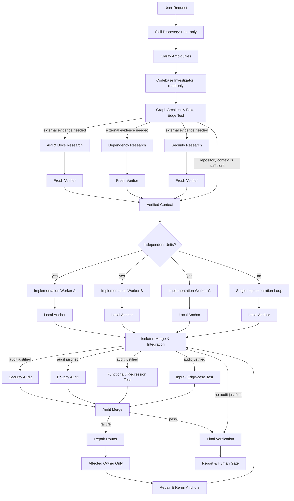

<div align="center">

# Graph Engineering Workflow

**Turn complex coding tasks into bounded, evidence-backed agent graphs.**

[](LICENSE)
[](SKILL.md)
[](SKILL.md)
[](#architecture--workflow)

<p align="center">
  <a href="#overview">Overview</a> •
  <a href="#when-to-use">When to Use</a> •
  <a href="#architecture--workflow">Workflow</a> •
  <a href="#quick-start-installation">Installation</a> •
  <a href="#specifications--deep-dives">Deep Dives</a> •
  <a href="#license">License</a>
</p>

---

</div>

## Overview

Graph Engineering Workflow is a portable Agent Skill designed for Antigravity (AGY), Codex, Claude Code, Hermes Agent, and modern agentic coding environments.

Rather than relying on unconstrained swarms or rigid linear checklists, this workflow:
- **Eliminates Fake Dependencies:** Distinguishes between truly independent work and artificial sequence constraints.
- **Enforces Fresh Verification:** Never trusts worker self-reports alone; tests code against compilers, linters, scanners, and real runtime anchors.
- **Pinpoints Targeted Repairs:** Routes failed audit findings strictly to the affected artifact's owner without restarting unrelated workers.
- **Protects with Human Gates:** Demands explicit user confirmation prior to irreversible operations (commits, pushes, deployments, deletions).

---

## When to Use

| Execution Mode | When to Choose | Examples |
| :--- | :--- | :--- |
| **Agent Graph** | • Independent, parallelizable units of work<br>• Multi-dimensional audits on the same build<br>• Concurrent writers needing isolated worktrees | Full-stack features (API + UI), cross-repository refactors, independent audits (Security + Privacy + Regression). |
| **Single Loop** | • Small, isolated scope<br>• Genuine step-by-step sequential dependencies<br>• Single component ownership | Single-file bugfixes, small script tweaks, documentation typo fixes. |

---

## Architecture & Workflow



> [!NOTE]
> This is a **dynamic capability map**, not a mandatory static pipeline. The graph automatically prunes research nodes, implementation branches, audits, and edges that your specific task does not justify.

---

## Quick Start: Installation

### Using the Skills CLI (Recommended)

Install using the open [`skills`](https://github.com/vercel-labs/skills) CLI:

```bash
# Install for all supported agents (Antigravity, Codex, Claude Code, Hermes Agent)
npx --yes skills add Thanarak-q/graph-engineering-workflow --global --yes --agent antigravity antigravity-cli codex claude-code hermes-agent

# Or install for a specific agent (e.g. antigravity or codex)
npx --yes skills add Thanarak-q/graph-engineering-workflow --global --yes --agent antigravity
```

<details>
<summary><b>CLI Inspection, Updates & Manual Installation</b></summary>

<br>

#### Inspect Package Without Installing
```bash
npx --yes skills add Thanarak-q/graph-engineering-workflow --list
```

#### Update or Remove
```bash
npx --yes skills update graph-engineering-workflow --global --yes
npx --yes skills remove graph-engineering-workflow --global --yes
```

#### Manual Installation (macOS / Linux)
```bash
git clone https://github.com/Thanarak-q/graph-engineering-workflow.git
cd graph-engineering-workflow

# Antigravity / Codex / Universal Agent Skills
mkdir -p "$HOME/.agents/skills/graph-engineering-workflow"
cp SKILL.md "$HOME/.agents/skills/graph-engineering-workflow/SKILL.md"

# Antigravity Global Config
mkdir -p "$HOME/.gemini/config/skills/graph-engineering-workflow"
cp SKILL.md "$HOME/.gemini/config/skills/graph-engineering-workflow/SKILL.md"

# Claude Code
mkdir -p "$HOME/.claude/skills/graph-engineering-workflow"
cp SKILL.md "$HOME/.claude/skills/graph-engineering-workflow/SKILL.md"

# Hermes Agent
mkdir -p "${HERMES_HOME:-$HOME/.hermes}/skills/graph-engineering-workflow"
cp SKILL.md "${HERMES_HOME:-$HOME/.hermes}/skills/graph-engineering-workflow/SKILL.md"
```

</details>

---

## Specifications & Deep Dives

Click on any section below to expand the detailed specification:

<details>
<summary><b>1. How It Works (11-Step Lifecycle)</b></summary>

<br>

1. **Discover skills (read-only):** Inspect available environment skills and select only those that materially benefit specific nodes.
2. **Clarify requirements:** Ask targeted, high-value questions when requirements or constraints are ambiguous.
3. **Investigate codebase (read-only):** Map project rules, affected files, tests, and interfaces before making changes.
4. **Construct graph & test edges:** Apply the fake-edge test to every proposed dependency:
   > *What exact output crosses this edge, and does the downstream job fail without it?*
   If the dependency is not strictly necessary, the edge is removed.
5. **Fan out selectively:** Parallelize research, implementation, or audits only when work units are truly independent.
6. **Verify with fresh context:** Never trust worker self-reports alone. Verifiers run in isolated contexts using tests, compilers, linters, scanners, or API checks.
7. **Isolate concurrent writers:** Use separate worktrees, branches, or containers when multiple workers modify code.
8. **Single-owner merge:** A designated merge owner reconciles branches and documents conflict resolutions.
9. **Narrow repair routing:** Send failed audit findings directly to the responsible component owner, rerunning only affected checks and regressions.
10. **Cap execution:** Set explicit limits on worker count, concurrency, waves, retries, runtime, and budget.
11. **Enforce human gates:** Require explicit human approval before irreversible actions (commit, push, deploy, publish, deletion, payments).

</details>

<details>
<summary><b>2. Example Walkthrough (Email & Password Authentication)</b></summary>

<br>

**User Goal:** *"Implement email/password authentication across the API and web UI."*

| Step | Action | Details |
| :--- | :--- | :--- |
| **1. Discovery & Investigation** | Read-only scan | Inspects existing auth routes, schemas, and test harnesses without touching files. |
| **2. Graph Planning** | Topology selection | Determines external research is unnecessary. Splits work into parallel backend API and frontend UI branches based on file boundaries. |
| **3. Implementation & Anchors** | Isolated workers | Workers implement endpoints and forms in isolated workspaces, verifying with local unit tests and linters. |
| **4. Merge & Integration** | Single merge owner | Merges feature branches into the integration branch and executes the full build suite. |
| **5. Audit Fan-out** | Targeted checks | Runs concurrent security (SQLi/XSS), privacy (token logging), and regression audits on the integrated build. |
| **6. Targeted Repair** | Narrow route | Privacy audit detects token exposure in debug logs -> routes the fix solely to the backend owner -> reruns privacy + regression checks. |
| **7. Human Gate** | Final verification | All checks pass; outputs summary and prompts user for explicit approval before commit. |

</details>

<details>
<summary><b>3. Deliverables & Output Contract</b></summary>

<br>

For non-trivial tasks, the workflow produces structured, inspectable outputs:

- **Graph Plan:** Verified task units, real dependencies, and ownership boundaries.
- **Skill Plan:** Selected skills per node and explicit reasons for skipped skills.
- **Execution Limits:** Strict caps on workers, concurrency, retries, runtime, and budget.
- **Verified Findings:** Factual claims backed by source citations, code locations, or scan output.
- **Change Summary:** Exact files modified and test/build commands executed.
- **Audit Reports:** Targeted results across security, privacy, performance, and regression dimensions.
- **Repair Records:** Narrow routing history and any remaining trade-offs.
- **Human Gate Request:** Confirmation prompt prior to commits, pushes, deployments, or destructive actions.

</details>

<details>
<summary><b>4. Optional Companion Skills</b></summary>

<br>

Graph Engineering Workflow operates completely standalone. Installing companion skills enhances routing for specific node types when installed:

### Engineering Companions
Install from [mattpocock/skills](https://github.com/mattpocock/skills):
```bash
npx skills@latest add mattpocock/skills
```
*Recommended skills:* `to-spec`, `domain-modeling`, `codebase-design`, `research`, `implement`, `tdd`, `code-review`, `diagnosing-bugs`, `resolving-merge-conflicts`, `handoff`, `prototype`, `improve-codebase-architecture`, and `grill-me`.

### Security & Audit Companions
For security, privacy, and dependency audit nodes, install [devsecops](https://github.com/Thanarak-q/devsecops):
```bash
npx --yes skills add Thanarak-q/devsecops --global --yes --agent codex
```

</details>

---

## License

This project is licensed under the terms of the [MIT License](LICENSE).
