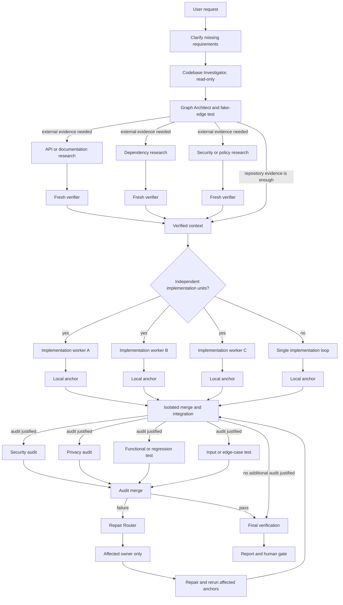

# Graph Engineering Workflow

## Overview

A portable Agent Skill for Codex, Claude Code, and Hermes Agent. It turns complex coding work into bounded, evidence-backed agent graphs.

The skill identifies genuinely independent work, removes fake dependencies, verifies worker output against real evidence, and routes failures only to the owner of the affected artifact.

## Install

### Install for All Three Agents

The recommended installer is the open [`skills`](https://github.com/vercel-labs/skills) CLI:

```bash
npx --yes skills add Thanarak-q/graph-engineering-workflow \
  --global \
  --yes \
  --agent codex claude-code hermes-agent
```

This command installs `graph-engineering-workflow` for Codex, Claude Code, and Hermes Agent. Start a new agent session after installation.

To inspect the package without installing it:

```bash
npx --yes skills add Thanarak-q/graph-engineering-workflow --list
```

### Install for One Agent

Replace the agent name with `codex`, `claude-code`, or `hermes-agent`:

```bash
npx --yes skills add Thanarak-q/graph-engineering-workflow \
  --global \
  --yes \
  --agent codex
```

### Update or Remove

```bash
npx --yes skills update graph-engineering-workflow --global --yes
npx --yes skills remove graph-engineering-workflow --global --yes
```

### Manual Install (macOS/Linux)

```bash
git clone https://github.com/Thanarak-q/graph-engineering-workflow.git
cd graph-engineering-workflow
```

Copy `SKILL.md` to the agent you use:

```bash
# Codex / universal Agent Skills location
mkdir -p "$HOME/.agents/skills/graph-engineering-workflow"
cp SKILL.md "$HOME/.agents/skills/graph-engineering-workflow/SKILL.md"

# Claude Code
mkdir -p "$HOME/.claude/skills/graph-engineering-workflow"
cp SKILL.md "$HOME/.claude/skills/graph-engineering-workflow/SKILL.md"

# Hermes Agent
mkdir -p "${HERMES_HOME:-$HOME/.hermes}/skills/graph-engineering-workflow"
cp SKILL.md "${HERMES_HOME:-$HOME/.hermes}/skills/graph-engineering-workflow/SKILL.md"
```

## What It Does

Use this skill for feature work, migrations, repository audits, security reviews, or research when the task contains independent work.

It does not create a large agent swarm by default. A small task with real sequential dependencies stays a single-agent loop.

The Graph Architect applies one test to every proposed edge:

> What exact result crosses this edge, and does the downstream job need it?

If the answer is not concrete, the edge is removed.

## Example

A user asks:

> Implement email/password login across the API and web UI.

The agent first clarifies missing requirements, then runs a read-only Codebase Investigator to map project rules, affected files, tests, interfaces, and ownership boundaries.

The Graph Architect decides whether external research is necessary. If the repository already answers the question, research is skipped. If backend, frontend, and test work have separate ownership boundaries, they can run independently. Otherwise, the work stays in one implementation loop.

After integration, the graph selects audits that match the change. If a privacy audit finds a sensitive value in a log, the Repair Router sends the finding only to the owner of that logging code, then reruns the affected privacy and regression checks.

## Workflow



This is a capability map, not a fixed pipeline. The graph removes research, implementation workers, audits, and edges that the task does not justify.

## How It Works

1. **Clarify** only what the request leaves unclear.
2. **Investigate read-only** before changing a repository.
3. **Build the graph** from real dependencies and explicit artifact ownership.
4. **Fan out selectively** when research, implementation, or audit work is independent.
5. **Verify in fresh context** using source evidence, tests, builds, scanners, API behavior, or another real anchor.
6. **Isolate concurrent writers** with worktrees, branches, containers, or equivalent boundaries.
7. **Merge with one owner** and preserve conflicts instead of silently choosing a result.
8. **Repair narrowly** and rerun only affected checks plus required regression checks.
9. **Cap execution** with explicit worker, concurrency, wave, retry, time, and budget limits.
10. **Report evidence** and stop at a human gate before irreversible actions.

## When to Use It

Use a graph when independent work exists, separate verification matters, or several audit dimensions can inspect the same integrated artifact.

Use a single-agent loop when the task is small, one area owns the work, or each step genuinely needs the previous result.

## What You Get

For a non-trivial task, the agent should produce:

- a compact graph plan with real dependencies and ownership;
- explicit worker, concurrency, retry, time, and budget limits;
- verified findings with evidence;
- changed files and commands actually run;
- selected audit results;
- narrow repair routes and unresolved risks;
- a human gate before commit, push, deploy, publish, deletion, payment, or an external send.

## License

MIT
