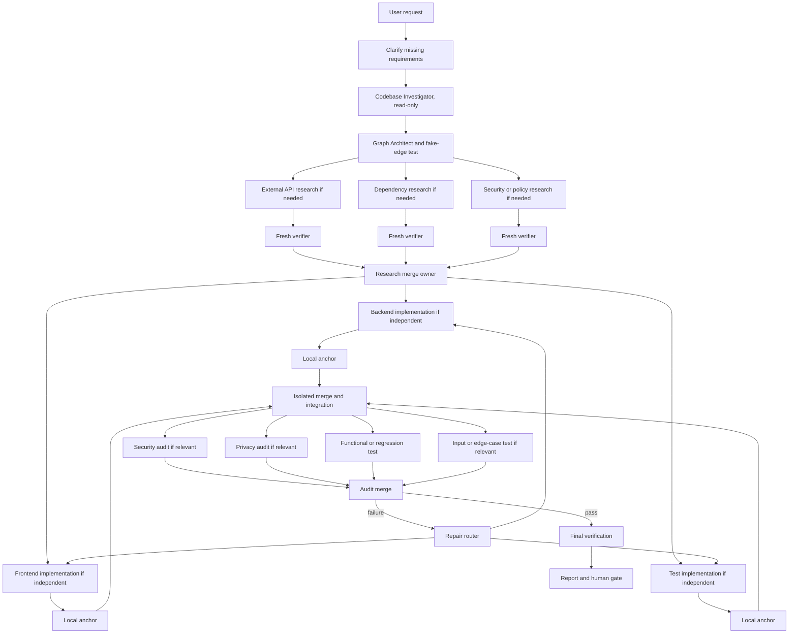

# Graph Engineering Workflow

A portable skill for Hermes, Codex, and Claude Code that turns coding work into a **graph of verified loops**.

It finds work that is genuinely independent, removes fake dependencies, runs only the workers that are justified, verifies evidence in a fresh context, and sends failures back to the worker that owns the problem.

## Install

Clone this repository:

```bash
git clone https://github.com/<OWNER>/<REPOSITORY>.git
cd <REPOSITORY>
```

Replace `<OWNER>` and `<REPOSITORY>` with the real GitHub path.

### Hermes

```bash
mkdir -p "${HERMES_HOME:-$HOME/.hermes}/skills/autonomous-ai-agents/graph-engineering-workflow"
cp SKILL.md "${HERMES_HOME:-$HOME/.hermes}/skills/autonomous-ai-agents/graph-engineering-workflow/SKILL.md"
```

### Codex

```bash
mkdir -p "$HOME/.codex/skills/graph-engineering-workflow"
cp SKILL.md "$HOME/.codex/skills/graph-engineering-workflow/SKILL.md"
```

### Claude Code

```bash
mkdir -p "$HOME/.claude/skills/graph-engineering-workflow"
cp SKILL.md "$HOME/.claude/skills/graph-engineering-workflow/SKILL.md"
```

Start a new agent session after installation.

## What it does

Use this skill for feature work, migrations, repository audits, security reviews, or research when the task contains independent work.

It does **not** create a large agent swarm by default. A small task with real sequential dependencies stays a single-agent loop.

The core test is simple:

> What exact result must cross this edge? If the next job does not need it, remove the edge and run the jobs independently.

## Example

A user asks:

> Implement email/password login across the API and web UI.

The agent begins with a read-only **Codebase Investigator** to map the project rules, affected areas, tests, ownership boundaries, and unknowns. The Graph Architect then decides whether any external API, dependency, or security-policy research is actually needed.

After verified external research is merged, backend, frontend, and test work can run separately only if their ownership boundaries do not overlap.

After integration, the graph selects the relevant audits. If a privacy audit finds a sensitive value in a log, the repair route goes to the logging owner, then reruns that privacy check and the affected regression tests. It does not restart unrelated workers.

## The graph



This is a template, not a fixed pipeline. The Graph Architect removes research, workers, audits, and edges that the task does not need.

## How it works

1. **Clarify** only what the request leaves unclear.
2. **Investigate the codebase read-only** before graph design. Map rules, affected files, tests, interfaces, ownership boundaries, and unresolved questions.
3. **Build the graph** from real dependencies and explicit artifact ownership.
4. **Add external research only when needed**, then fan it out only when the unanswered questions are independent.
5. **Verify** research and worker claims with source evidence, tests, builds, scanners, or other real anchors.
6. **Merge** with one owner. Concurrent writers use separate worktrees, branches, containers, or another isolation boundary.
7. **Audit** the integrated result according to the change: security, privacy, functional behavior, input handling, regression risk, code quality, or dependencies.
8. **Repair narrowly** by routing a finding to its responsible owner and rerunning only affected checks.
9. **Report evidence**, not confidence. The final result lists changed files, commands actually run, audit results, remaining risks, and required human decisions.

## When to use it

Use a graph when independent work exists, separate verification matters, or several audit dimensions can inspect the same integrated artifact.

Use a single-agent loop when the task is small, one area owns the work, or every step genuinely depends on the result before it.

## What you get

For a non-trivial task, the agent should produce:

- a compact graph plan with real dependencies, worker ownership, and explicit worker/concurrency/retry/time/budget caps;
- verified research findings and their evidence;
- changed files and local verification results;
- selected audit results;
- repair routes and unresolved risks;
- an explicit human gate before commit, push, deploy, publish, deletion, payment, or an external send.
